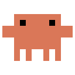
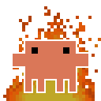
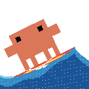

# ClawdMoji

Pixel-perfect recreations of the **Clawd** mascot as Slack emoji, plus three
animated variants. Everything is generated programmatically from the original
logo — no image editor involved.

| Base | "This is fine" 🔥 | Rainy day 🌧️ | Surfing 🏄 |
|:----:|:-----------------:|:-------------:|:----------:|
|  |  |  |  |
| static, transparent | animated, seamless loop | animated, seamless loop | animated, seamless loop |

All outputs are **128×128 PNG/GIF** with transparent backgrounds, sized for
Slack custom emoji (≤ 128 KB).

---

## The pixel grid

The starting point was a screenshot of the "Welcome, Clawd" splash
([`source/clawd_source.png`](source/clawd_source.png)). [`scripts/analyze_grid.py`](scripts/analyze_grid.py)
recovers the pixel-art grid underneath it:

1. isolate the orange body by colour,
2. find every silhouette edge, cluster out the ~1 px anti-aliasing jitter,
3. pick the cell size that best divides all the edge positions.

Result — the logo is drawn on a **12 × 8 grid**, cell ≈ **18 px** in the
335×597 source (the detector reports a 9 px / 24×16 *harmonic* because every
feature is exactly two cells thick; the native art is 12×8). Sampled colours:
body `#DA7758`, eyes `#000000`.

```
..########..
..#O####O#..   O = eye
############
############
..########..
..########..
..#.#..#.#..   legs
..#.#..#.#..
```

This `ART` string is the single source of truth — every render script draws
from it, so the creature is identical across all variants.

---

## The emoji

### Base — [`render_emoji.py`](scripts/render_emoji.py)
The grid rendered with integer-pixel cells (10 px) so it stays razor-sharp at
any zoom. Outputs the padded square `clawd_emoji.png` and a tight,
exactly-proportioned `clawd_emoji_tight.png`.

### "This is fine" — [`render_fire_anim.py`](scripts/render_fire_anim.py)
Calm Clawd in front of a burning room, composited from two layers:
- **fire (back):** a real [Doom-fire](https://fabiensanglard.net/doom_fire_psx/)
  simulation on a coarse 32-grid — a hot source row propagates upward with
  random decay + flicker, mapped through the classic dark→red→orange→yellow
  palette. A per-column source profile tapers the flames into a triangle; a
  colour cap keeps the base yellow (not white).
- **Clawd (front):** the sprite on a fine 64-grid so its **white border** is a
  thin 2 px outline.

Because Doom-fire is chaotic, the **seamless loop** is found by running a long
simulation and cutting at the frame that best matches frame 0 (the tiny seam is
hidden by the natural flicker). A static fallback is saved as `clawd_fire_still.png`.

> ⚠️ `clawd_fire.gif` is ~102 KB — just under Slack's 128 KB cap. Lower `MAXL`
> or raise `DUR` if you need it smaller.

### Rainy day — [`render_rain_anim.py`](scripts/render_rain_anim.py)
Clawd under a storm cloud, four composited layers (cloud → back rain → Clawd →
front rain):
- **cloud:** a full-width band of churning grey with a ragged underside; its
  internal texture scrolls horizontally.
- **rain:** fat drops, most *behind* Clawd and a few *in front*, falling at a
  slight angle (the field is **sheared** — each drop's column shifts with its
  row). Front rain falls faster for a parallax feel.
- **splashes:** subtle 3-frame pops along the floor, phased so a few fire at a
  time.

Here the **loop is exactly seamless by construction**: rain wraps on a vertical
tile (`V·F` is a multiple of `TILE`), the cloud wraps on a horizontal tile
(`S·F = P`), and splashes are a pure function of `frame mod F`.

### Surfing — [`render_surf_anim.py`](scripts/render_surf_anim.py)
Clawd dropping down the face of a breaking wave on a red surfboard, composited
back-to-front (ocean → crest foam → Clawd+board → waterline wash + bow-spray).
Unlike the other emoji this one renders on the **full 128 grid** (`CELL=1`), so
Clawd is bigger, more central, and his edges/rotation are half the block size —
noticeably less pixelated:
- **ocean:** a low raised swell peaks on the right and slopes down to a flatter
  sea on the left (the face Clawd rides), filled with depth-banded blues and a
  scrolling sparkle of sunlit glints; a white foam cap breaks along the lip.
- **Clawd + board:** Clawd (full 2 px white outline) stands on a fat surfboard;
  the two are built as **one assembly** and **rotated together** so they lean
  down the face, pivoting about the board's water-contact point. The lean is
  **matched to the face slope** and the board is **sunk** slightly so it planes
  *through* the wave rather than floating over it. A gentle rock and a vertical
  bob keep them alive on the wave.
- **spray:** a thin bright **foam wash** breaks along the waterline where the
  board cuts the wave, and a little **bow-spray** kicks up off the nose.

The **loop is seamless by construction**: the bob, the rock, and the bow-spray's
flicker are all `sin(2π·f/F)`; the swell ripple and sparkle scroll advance a
whole number of cycles over the loop (phase `2π·(… − k·f/F)`); the waterline
wash is a static ragged pattern.

---

## Regenerate

Requires Python 3 with Pillow and NumPy:

```bash
pip install pillow numpy

# run from anywhere — scripts resolve paths relative to themselves
python3 scripts/analyze_grid.py      # prints the recovered grid (writes build/)
python3 scripts/render_emoji.py      # -> emoji/clawd_emoji*.png
python3 scripts/render_fire_anim.py  # -> emoji/clawd_fire.gif + still
python3 scripts/render_rain_anim.py  # -> emoji/clawd_rain.gif + still
python3 scripts/render_surf_anim.py  # -> emoji/clawd_surf.gif + still
```

Each animated script exposes tunable constants near the top — flame
height/taper/threshold for fire; drop size, speed, slant, cloud churn, and
splash frequency for rain; wave geometry, bob, ripple, and spray for surf.
`render_fire.py` is the original *static* "this is fine" (kept for reference;
the animated version supersedes it).

## Add to Slack

**Settings → Customize → Emoji → Add Custom Emoji**, upload a file from
`emoji/`, and give it a name (e.g. `:clawd:`, `:clawd-fine:`, `:clawd-rain:`,
`:clawd-surf:`).
Animated GIFs animate inline.

## Layout

```
ClawdMoji/
├── source/   original logo screenshot
├── scripts/  analysis + render scripts (path-robust)
├── emoji/    generated outputs (committed)
└── build/    intermediate arrays from analyze_grid.py (gitignored)
```
