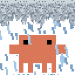
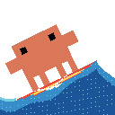
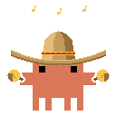
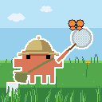
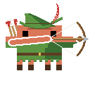
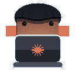

# ClawdMoji

[](LICENSE)
[](CONTRIBUTING.md)
[](#the-emoji)
[](#regenerate)

Pixel-perfect recreations of the **Clawd** mascot as Slack emoji, plus seven
animated variants. Everything is generated programmatically from the original
logo — no image editor involved.

<!-- gallery:begin -->
| **Original Clawdster** | **This is Clawd** 🔥 | **London Clawd** 🌧️ | **Clawd Surfing** 🏄 |
|:---:|:---:|:---:|:---:|
|  |  |  |  |
| **Mariachlawd** 🪇 | **Bug Claught** 🦋 | **Clawdin Hood** 🏹 | **Clawd Injection** 💉 |
|  |  |  |  |
<!-- gallery:end -->

Browse the **[live gallery](https://afspies.github.io/ClawdMoji/)** (GIFs
animate + click-to-copy Slack names), or grab the ready-to-upload
**[emoji pack](https://github.com/afspies/ClawdMoji/releases)**.

All outputs are **128×128 PNG/GIF** with transparent backgrounds, sized for
Slack custom emoji (≤ 128 KB).

---

## The pixel grid

The starting point was a screenshot of the "Welcome, Clawd" splash
([`source/clawd_source.png`](source/clawd_source.png)). [`tools/analyze_grid.py`](tools/analyze_grid.py)
recovers the pixel-art grid underneath it:

1. isolate the orange body by colour,
2. find every silhouette edge, cluster out the ~1 px anti-aliasing jitter,
3. pick the cell size that best divides all the edge positions.

Result — the logo is drawn on a **12 × 8 grid**, cell ≈ **18 px** in the
335×597 source (the detector reports a 9 px / 24×16 *harmonic* because every
feature is exactly two cells thick; the native art is 12×8). Sampled colours:
body `#DA7758`, eyes `#000000`.

```
..########..
..#O####O#..   O = eye
############
############
..########..
..########..
..#.#..#.#..   legs
..#.#..#.#..
```

This grid lives in [`shared/clawd.py`](shared/clawd.py) as the `ART` string —
the single source of truth every render script imports, so the creature is
identical across all variants. That module also holds the sampled colours and
the white-outline dilation the renderers share.

---

## The emoji

### Original Clawdster — [`base/render.py`](emoji/base/render.py)
The grid rendered with integer-pixel cells (10 px) so it stays razor-sharp at
any zoom. Outputs the padded square `clawd_emoji.png` and a tight,
exactly-proportioned `clawd_emoji_tight.png`.

### This is Clawd 🔥 — [`fire/render.py`](emoji/fire/render.py)
Calm Clawd in front of a burning room — the "this is fine" meme — composited from
two layers:
- **fire (back):** a real [Doom-fire](https://fabiensanglard.net/doom_fire_psx/)
  simulation on a coarse 32-grid — a hot source row propagates upward with
  random decay + flicker, mapped through the classic dark→red→orange→yellow
  palette. A per-column source profile tapers the flames into a triangle; a
  colour cap keeps the base yellow (not white).
- **Clawd (front):** the sprite on a fine 64-grid so its **white border** is a
  thin 2 px outline.

Because Doom-fire is chaotic, the **seamless loop** is found by running a long
simulation and cutting at the frame that best matches frame 0 (the tiny seam is
hidden by the natural flicker). A static fallback is saved as `clawd_fire_still.png`.

> ⚠️ `clawd_fire.gif` is ~102 KB — just under Slack's 128 KB cap. Lower `MAXL`
> or raise `DUR` if you need it smaller.

### London Clawd 🌧️ — [`rain/render.py`](emoji/rain/render.py)
Clawd under a storm cloud, four composited layers (cloud → back rain → Clawd →
front rain):
- **cloud:** a full-width band of churning grey with a ragged underside; its
  internal texture scrolls horizontally.
- **rain:** fat drops, most *behind* Clawd and a few *in front*, falling at a
  slight angle (the field is **sheared** — each drop's column shifts with its
  row). Front rain falls faster for a parallax feel.
- **splashes:** subtle 3-frame pops along the floor, phased so a few fire at a
  time.

Here the **loop is exactly seamless by construction**: rain wraps on a vertical
tile (`V·F` is a multiple of `TILE`), the cloud wraps on a horizontal tile
(`S·F = P`), and splashes are a pure function of `frame mod F`.

### Clawd Surfing 🏄 — [`surf/render.py`](emoji/surf/render.py)
Clawd dropping down the face of a breaking wave on a red surfboard, composited
back-to-front (ocean → crest foam → crest spray → Clawd+board → waterline
wash + bow-spray).
Unlike the other emoji this one renders on the **full 128 grid** (`CELL=1`), so
Clawd is bigger, more central, and his edges/rotation are half the block size —
noticeably less pixelated:
- **ocean:** a low raised swell peaks on the right and slopes down to a flatter
  sea on the left (the face Clawd rides), filled with depth-banded blues and a
  scrolling sparkle of sunlit glints; a white foam cap breaks along the lip.
- **Clawd + board:** Clawd (full 2 px white outline) stands on a fat surfboard;
  the two are built as **one assembly** and **rotated together** so they lean
  down the face, pivoting about the board's water-contact point. The lean is
  **matched to the face slope** and the board is **sunk** slightly so it planes
  *through* the wave rather than floating over it. A gentle rock and a vertical
  bob keep them alive on the wave.
- **spray:** a **rooster-tail** fans up off the wave lip (drawn behind Clawd so
  it sits in the right depth), a thin bright **foam wash** breaks along the
  waterline where the board cuts the wave, and a little **bow-spray** kicks up
  off the nose.

The **loop is seamless by construction**: the bob, the rock, and the bow-spray's
flicker are all `sin(2π·f/F)`; the swell ripple and sparkle scroll advance a
whole number of cycles over the loop (phase `2π·(… − k·f/F)`); the crest spray
is a pure function of `frame mod F`; the waterline wash is a static ragged
pattern.

### Mariachlawd 🪇 — [`mariachi/render.py`](emoji/mariachi/render.py)
Clawd in a big straw sombrero, gripping a maraca by the handle in each hand and
shaking them as he dances. Like surf it renders on the **full 128 grid**
(`CELL=1`) so the sombrero's curves and the round bulbs stay crisp:
- **body + hat:** Clawd (full 2 px white outline) and a wide sombrero (rounded
  straw crown, red band with gold studs, up-curled brim, bolita trim) are one
  rigid piece that **steps left↔right** with a little bounce.
- **arms:** each side is two layers rotated together about the shoulder — an
  orange arm *behind* Clawd, and the maraca (gripped by the **handle**, bulb on
  the far end) composited in *front* so the handle reads as held out over the
  arm. Rotating them makes the maracas visibly **shake**; because the two arms
  are mirror images rotated by the same angle, they alternate (one up, one
  down) for a cha-cha feel.
- **flair:** a couple of gold **music notes** bob overhead.

The **loop is seamless by construction**: the side-step is `sin(2π·f/F)`, the
bounce is `|sin(2π·f/F)|`, the maraca shake is `sin(2π·2f/F)` (two shakes per
loop) and the note bob is `sin`/`cos` of `2π·f/F` — all equal at `f=0` and `f=F`.

### Bug Claught 🦋 — [`bugcatcher/render.py`](emoji/bugcatcher/render.py)
Clawd out in a sunny meadow in a pith helmet and a collector's satchel, swinging
a handheld net at a butterfly that keeps fluttering just out of reach. Full 128
grid (`CELL=1`) so the helmet dome, the mesh hoop and the butterfly stay crisp.
Unlike the sprite-on-transparent emoji this one is a **full opaque scene** that
fills the square, composited back-to-front (sky + clouds → grass → flowers →
Clawd → net → butterfly → foreground grass):
- **field:** a blue sky with a couple of soft clouds over a green meadow of
  swaying blades and flowers.
- **Clawd:** full 2 px white outline, in a khaki **pith helmet** (rounded dome,
  band, wide down-curved brim, top knob) with a strap-slung **satchel** — one
  rigid piece with a tiny bob.
- **net:** an orange arm grips a long pole ending in a woven **mesh hoop**; the
  whole arm + pole + net is **one assembly rotated about the shoulder**, so it
  swings up and back once per loop.
- **butterfly:** flaps its wings and flies a little evasive figure-eight, staying
  a few pixels above the hoop at the top of every swing — *so close*.

The **loop is seamless by construction**: the net swing is `sin(2π·f/F)`, the
butterfly path is `sin`/`sin(2·)` of `2π·f/F`, the wing flap is `cos(2π·3f/F)`
(three flaps per loop) and the grass sway is `sin(2π·f/F)` — all equal at `f=0`
and `f=F`. Because the field fills the whole square, the GIF is written as full
opaque frames (`disposal=1`, no transparency) so nothing flickers.

### Clawdin Hood 🏹 — [`robinhood/render.py`](emoji/robinhood/render.py)
A cute forest archer: Clawd in a pointed feathered cap and a green tunic
(belt + buckle, zig-zag hem, little boots), a quiver slung across his back,
drawing a bow and loosing an arrow that streaks off to the right — over and over.
Full 128 grid (`CELL=1`) so the bow curve, the string and the arrow stay crisp, and
drawn **large** so Clawd fills most of the frame — the bow tucks against the right
edge, so the loosed arrow has only a short run (the whoosh sells it). Every pixel
constant is a multiple of `SCALE` (`sc(v) = round(v·SCALE/6)`), so bumping `SCALE`
rescales the whole archer coherently:
- **body + cap:** Clawd (full 2 px white outline) recoloured into the tunic, with
  a flop-back cap, a brown hatband and a red feather.
- **his own arms:** Clawd's side bumps (the wide `ART` rows 2–3) *are* his arms.
  The **right** one reaches the bow — a short forearm joins it to the grip, which
  sits inboard against his hand rather than way out at arm's length. The **left**
  one bends up-and-in so the fist draws the string to his cheek (a diagonal line,
  never a bar across the face).
- **bow:** a wooden bow, a single **static** piece — the whole shot happens on the
  string, so nothing has to rotate.
- **shot:** the left arm draws the **string + nocked arrow** to full, looses with a
  forward **snap + twang**, and the arrow streaks off to the right (**head first**,
  fletching trailing, with a little **whoosh**) before a fresh arrow is nocked.

The **loop is seamless by construction**: full-draw (the aim) is identical at
`f=0` and `f=F`; on release the string snaps forward and a **damped return**
(`(1−smoothstep)·(1+sin)`) brings it back to the draw by the last frame, and the
loosed arrow clears the right edge before the loop wraps — so only a fresh nocked
arrow re-appears, the natural "re-load" beat.

### Clawd Injection 💉 — [`hacker/render.py`](emoji/hacker/render.py)
Hacker Clawd: hood up, face lit only by his laptop — which we see **from the
back**, the screen hidden, an Anthropic spark where an apple would go. Full 128
grid (`CELL=1`), everything a multiple of `SCALE` (`sc(v) = round(v·SCALE/7)`):
- **hoodie:** the authentic Clawd silhouette recoloured into dark fabric, plus a
  hood dome that **dips to a point over the brow** and casts a shadow band on
  his face; drape folds and ordered dithering give it a knit texture. His little
  orange **side-hands** (the `ART` rows 2–3 bumps) poke out below.
- **laptop:** a slab-and-lid seen from behind, with the **Anthropic spark** in
  clay-orange on the lid — static, like the real logo, not part of the light show.
- **glow:** the screen light is modelled as a wash escaping over the lid's top
  edge — a flat directional falloff `1/(1+(dy/DY)²+(dx/DX)²)`, not a spotlight —
  and each material (skin, brow shadow, hood, seam) is swept through its own
  dark→lit ramp per frame, **Bayer-dithered** so the gradient never bands.

The **loop is seamless by construction**: the glow level is a pure sinusoid in
`f/F` (a gentle two-harmonic breathe), so frame 0 and frame F match exactly.

---

## Regenerate

Requires Python 3 with Pillow and NumPy:

```bash
pip install pillow numpy

# run from anywhere — each script writes into its own folder and imports shared/
python3 tools/analyze_grid.py       # prints the recovered grid (writes build/)
python3 emoji/base/render.py        # -> emoji/base/clawd_emoji*.png
python3 emoji/fire/render.py        # -> emoji/fire/clawd_fire.gif + still
python3 emoji/rain/render.py        # -> emoji/rain/clawd_rain.gif + still
python3 emoji/surf/render.py        # -> emoji/surf/clawd_surf.gif + still
python3 emoji/mariachi/render.py    # -> emoji/mariachi/clawd_mariachi.gif + still
python3 emoji/bugcatcher/render.py  # -> emoji/bugcatcher/clawd_bugcatcher.gif + still
python3 emoji/robinhood/render.py   # -> emoji/robinhood/clawd_robinhood.gif + still
python3 emoji/hacker/render.py      # -> emoji/hacker/clawd_hacker.gif + still
```

Each animated script exposes tunable constants near the top — flame
height/taper/threshold for fire; drop size, speed, slant, cloud churn, and
splash frequency for rain; wave geometry, bob, ripple, and spray for surf;
sway/hop/tilt and the sombrero + maraca geometry for mariachi; the net swing,
butterfly flutter, and helmet/net/field geometry for bug catcher; the draw/release
timing, arrow speed, and bow/cap/tunic geometry for Robin Hood; the glow
falloff/level and hood/laptop geometry for the hacker.
[`emoji/fire/render_static.py`](emoji/fire/render_static.py) is the original
*static* "this is fine" (kept for reference; the animated version supersedes it).

## Add to Slack

**Settings → Customize → Emoji → Add Custom Emoji**, upload a file from the
relevant `emoji/<name>/` folder, and give it a name (e.g. `:clawd:`,
`:clawd-fine:`, `:clawd-rain:`, `:clawd-surf:`, `:clawd-mariachi:`,
`:clawd-bugcatcher:`, `:clawd-robinhood:`, `:clawd-injection:`). Animated GIFs
animate inline.

## Layout

Each emoji is a self-contained folder — its render script plus the committed
output(s) it produces — over a shared sprite definition:

Each folder also carries a `meta.json` (title, flair emoji, Slack name, blurb,
author) — [`tools/gen_gallery.py`](tools/gen_gallery.py) builds the gallery
table above and the [live gallery site](https://afspies.github.io/ClawdMoji/)
(`docs/index.html`) from those, so adding a variant never touches the README
table by hand.

```
ClawdMoji/
├── shared/clawd.py   the ART grid + colours + outline helper (single source of truth)
├── source/           original logo screenshot
├── tools/            analyze_grid.py, gen_gallery.py, build_pack.py
├── docs/             generated gallery site (GitHub Pages)
├── emoji/
│   ├── base/         render.py + clawd_emoji*.png
│   ├── fire/         render.py (+ render_static.py) + clawd_fire.gif/still
│   ├── rain/         render.py + clawd_rain.gif/still
│   ├── surf/         render.py + clawd_surf.gif/still
│   ├── mariachi/     render.py + clawd_mariachi.gif/still
│   ├── bugcatcher/   render.py + clawd_bugcatcher.gif/still
│   ├── robinhood/    render.py + clawd_robinhood.gif/still
│   └── hacker/       render.py + clawd_hacker.gif/still
└── build/            intermediate arrays from analyze_grid.py (gitignored)
```

## Contributing

New Clawd variants are very welcome — a variant is just one folder with one
`render.py` (and a `meta.json`) on top of the shared sprite. See
[CONTRIBUTING.md](CONTRIBUTING.md) for the recipe, the hard constraints
(128×128, ≤ 128 KB, seamless loop, authentic Clawd), and a copyable starter in
[`emoji/_template/`](emoji/_template/). Not a coder? Open an
[emoji idea](https://github.com/afspies/ClawdMoji/issues/new?template=emoji-idea.yml)
instead.

## License

The **code** is [MIT](LICENSE). The **Clawd character** and the Anthropic spark
are Anthropic, PBC's — this is an unofficial fan project, not affiliated with
or endorsed by Anthropic, and no rights to the character or mark are granted.
